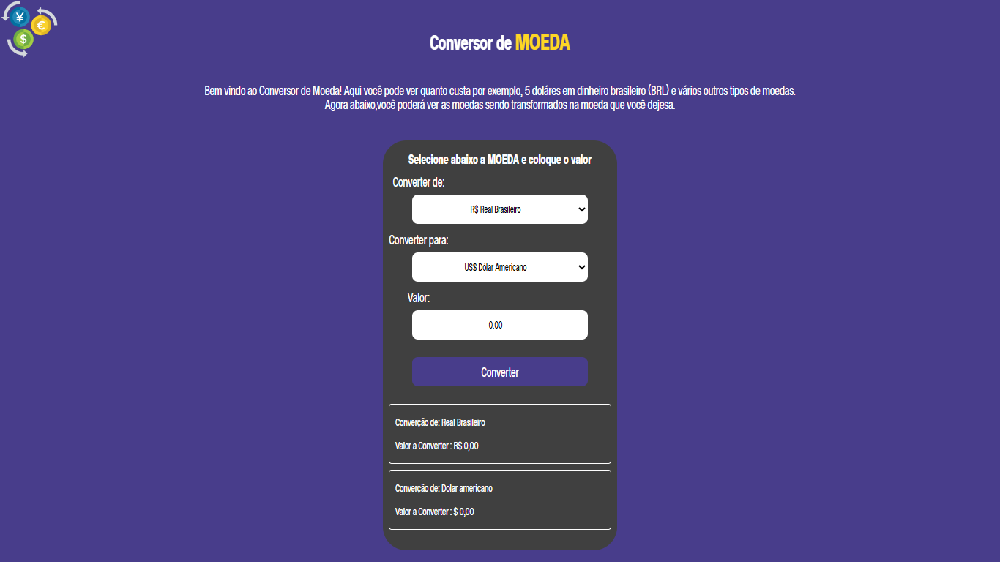
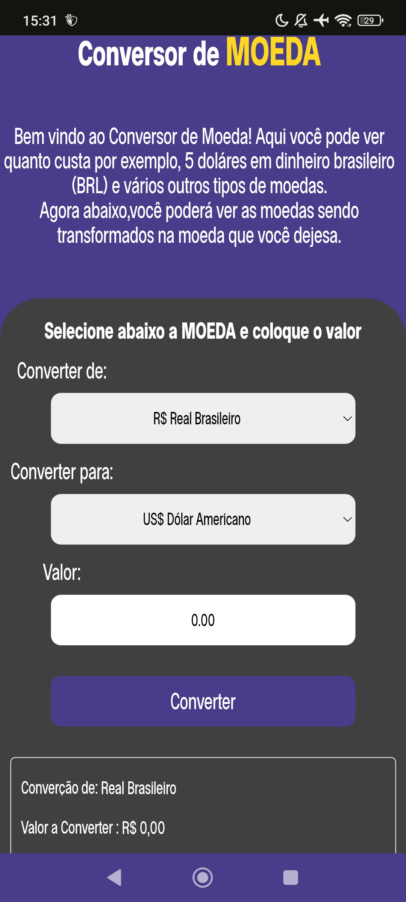

<h1 align="center">Conversor de Moeda 💲</h1>

Um conversor de moeda simples, desenvolvido em HTML, CSS e JavaScript. O usuário pode inserir um valor, escolher as moedas de origem e destino (Real, Dólar ou Euro) e visualizar o valor convertido usando taxas fixas definidas no código.

## Demonstração

👉 [Acesse o projeto online aqui](https://agdche.github.io/Conversor-de-Moeda/) <!-- Já está publicado, excelente! -->

## Funcionalidades

- Conversão entre Real, Dólar e Euro utilizando taxas fixas pré-definidas
- Interface simples, intuitiva e responsiva
- Atualização dinâmica do resultado conforme o valor ou moedas selecionados

## Tecnologias Utilizadas

- HTML
- CSS
- JavaScript

## Como rodar localmente

1. Clone este repositório:
   ```bash
   git clone https://github.com/AGDCHE/Conversor-de-Moeda.git
   
2.Acesse a pasta do projeto: cd Conversor-de-Moeda.

3.Abra o arquivo index.html no seu navegador.

## Aprendizados

- Lógica de conversão entre moedas com JS.
- Manipulação de select, input e eventos de formulário.
- Animações e responsividade com CSS.
- Organização e boas práticas em projetos simples.

## Possíveis melhorias futuras

- Adicionar conversão em tempo real usando uma API de câmbio.
- Incluir outras moedas.
- Validação mais elaborada dos campos.
  
## Prints (notebook vaio e android redmi note 13)
<div align="center">
  
  
</div>

## Licença

MIT
